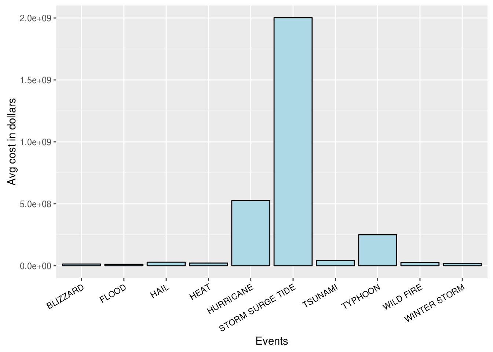
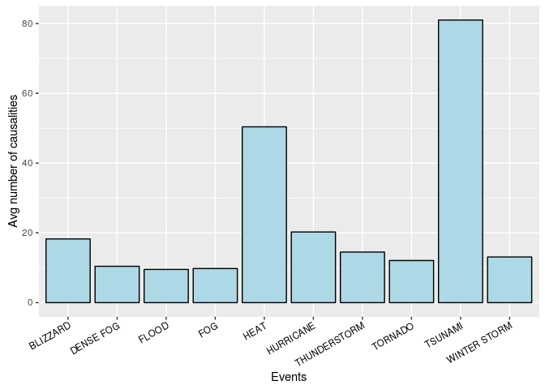

# Assignment: Most harmful and costly weather events
Victor de Lima Soares  
April 12, 2016  


## Synopsis
Several significant natural events impact our society with great effects. In order to account for circumstances that demand a carefully developed plan, the natural events data was analyzed to provide an overview of what events are the most dangerous, for the local population safety and in terms of economic losses.

## Disclaimer 
All topics discussed and results demonstrated here are part of a class assignment. As such, it should not be used for any purpose different from attributing a grade inside the context of that class. The content is provided AS-IS and no responsibility implied or explicit can be addressed to the author or his institution for its use or misuse. Any commercial use is prohibited.

## Target questions

Our data analysis was conducted to address the following questions:

	1. Across the United States, which types of events (as indicated in the EVTYPE variable) are most harmful with respect to population health?
	
	2. Across the United States, which types of events have the greatest economic consequences?

## Data Processing

Firstly, in order to begin our analysis, the dataset needs to be downloaded and extracted. The following code enabled us to obtain the data and extract it from its original package, a bz2 file.

[GitHub repository](https://github.com/victorlima02/Reproducible-Research-Harmful-Weather-Events)


```r
	dataDirectory <-'data'
	dataFile <- file.path(dataDirectory,'repdata_data_StormData.csv')
	compressedDataFile <- file.path(dataDirectory,'repdata_data_StormData.csv.bz2')
	
	#Verify the data directory existence
	if(!dir.exists(dataDirectory)){
	    dir.create(dataDirectory)
	}
	
	download.file(url='https://d396qusza40orc.cloudfront.net/repdata%2Fdata%2FStormData.csv.bz2',
		      destfile = compressedDataFile)
	
	bunzip2(compressedDataFile, destname=dataFile, overwrite=TRUE )
```

To start our analysis, we loaded the data into memory and selected the variables that were indicators to which events are the most harmful with respect to population health or have the greatest economic consequences.

Thus, we selected the following columns:

- EVTYPE (Event Type);
- FATALITIES (Fatalities);
- INJURIES (Injuries);
- PROPDMG (Property Damage);
- PROPDMGEXP (Property Damage Exponent);
- CROPDMG (Crop Damage);
- CROPDMGEXP (Crop Damage Exponent).

This selection was made by the following code:


```r
	storms <- read.csv(dataFile,header = TRUE)
	storms <- storms %>% select_(
		"EVTYPE", "FATALITIES",
		"INJURIES", "PROPDMG",
		"PROPDMGEXP", "CROPDMG", "CROPDMGEXP")
	str(storms)
```

```
## 'data.frame':	902297 obs. of  7 variables:
##  $ EVTYPE    : Factor w/ 985 levels "?","ABNORMALLY DRY",..: 830 830 830 830 830 830 830 830 830 830 ...
##  $ FATALITIES: num  0 0 0 0 0 0 0 0 1 0 ...
##  $ INJURIES  : num  15 0 2 2 2 6 1 0 14 0 ...
##  $ PROPDMG   : num  25 2.5 25 2.5 2.5 2.5 2.5 2.5 25 25 ...
##  $ PROPDMGEXP: Factor w/ 19 levels "","-","?","+",..: 17 17 17 17 17 17 17 17 17 17 ...
##  $ CROPDMG   : num  0 0 0 0 0 0 0 0 0 0 ...
##  $ CROPDMGEXP: Factor w/ 9 levels "","?","0","2",..: 1 1 1 1 1 1 1 1 1 1 ...
```

To count the total number of causalities, we added the number of fatalities and injuries. 
As this sum was used as indicator for the damage with respect to population health.


```r
	storms <- storms %>% 
		mutate(CAUSALITIES = FATALITIES+INJURIES) %>% 
		select(-c(FATALITIES,INJURIES))
```

To evaluate the cost inflicted by each event, as an indicator for the economic consequences, 
we used the variables containing the Property Damage and Crop Damage, 
while applying the exponents given by Property Damage Exponent and Crop Damage Exponent, respectively. 

The multipliers were: Hundred (H), Thousand (K), Million (M) and Billion (B)


```r
	storms$PROPDMGEXP <- toupper(storms$PROPDMGEXP)
	storms$CROPDMGEXP <- toupper(storms$CROPDMGEXP)
	
	storms$PROPDMGEXP <- gsub("^$| |\\?|\\+|-","1",storms$PROPDMGEXP)
	storms$CROPDMGEXP <- gsub("^$| |\\?|\\+|-","1",storms$CROPDMGEXP)
	
	storms$PROPDMGEXP <- gsub("^H$","2",storms$PROPDMGEXP)
	storms$CROPDMGEXP <- gsub("^H$","2",storms$CROPDMGEXP)
	
	storms$PROPDMGEXP <- gsub("^K$","3",storms$PROPDMGEXP)
	storms$CROPDMGEXP <- gsub("^K$","3",storms$CROPDMGEXP)
	
	storms$PROPDMGEXP <- gsub("^M$","6",storms$PROPDMGEXP)
	storms$CROPDMGEXP <- gsub("^M$","6",storms$CROPDMGEXP)
	
	storms$PROPDMGEXP <- gsub("^B$","9",storms$PROPDMGEXP)
	storms$CROPDMGEXP <- gsub("^B$","9",storms$CROPDMGEXP)
	
	storms <- storms %>% 
		mutate(PROPDMGEXP = 10^as.numeric(PROPDMGEXP), CROPDMGEXP=10^as.numeric(CROPDMGEXP)) %>%
		mutate(COSTS = PROPDMG * PROPDMGEXP + CROPDMG*CROPDMGEXP) %>%
		select(-c(PROPDMG, PROPDMGEXP, CROPDMG, CROPDMGEXP))
```

Such code leads to the following structure:


```r
	str(storms) 
```

```
## 'data.frame':	902297 obs. of  3 variables:
##  $ EVTYPE     : Factor w/ 985 levels "?","ABNORMALLY DRY",..: 830 830 830 830 830 830 830 830 830 830 ...
##  $ CAUSALITIES: num  15 0 2 2 2 6 1 0 15 0 ...
##  $ COSTS      : num  25000 2500 25000 2500 2500 2500 2500 2500 25000 25000 ...
```

Finally, we filtered the data to reduce the amount of redundancies, null values, while combining  possible combinations that could be semantically equal in the context of this study.

To remove null values:


```r
	#Filter for significant data, as most of the variables are null
	storms <- filter(storms, COSTS!=0 & CAUSALITIES!=0)  
```

Now we adjust the data to facilitate grouping:

```r
	storms$EVTYPE <- toupper(storms$EVTYPE)
	
	#The Data is extremely marked by typos and wording problems, possibly semantically erroneous.
	#This is an attempt to filter some inconsistencies. 
	storms$EVTYPE[grepl("HURRICANE|SUMMARY|TROPICAL", storms$EVTYPE)] <- "HURRICANE"
	storms$EVTYPE[grepl("FIRE", storms$EVTYPE)] <-"WILD FIRE"
	storms$EVTYPE[grepl("ICE|ICY|FREEZ|SNOW|WINT", storms$EVTYPE)] <-"WINTER STORM"
	storms$EVTYPE[grepl("CHILL|COLD", storms$EVTYPE)] <-"COLD"
	storms$EVTYPE[grepl("WIND", storms$EVTYPE)] <-"WIND"
	storms$EVTYPE[grepl("FLOOD|URBAN", storms$EVTYPE)] <-"FLOOD"
	storms$EVTYPE[grepl("HEAT", storms$EVTYPE)] <-"HEAT"
	storms$EVTYPE[grepl("DRY", storms$EVTYPE)] <-"DROUGHT"
	storms$EVTYPE[grepl("HAIL", storms$EVTYPE)] <-"HAIL"
	storms$EVTYPE[grepl("TORN|WATERSPROUT|FUNNEL|SPOUT|MICRO", storms$EVTYPE)] <- "TORNADO"
	storms$EVTYPE[grepl("RAIN", storms$EVTYPE)] <-"RAIN"
	
	storms$EVTYPE <- gsub("TSTM", "THUNDERSTORM", storms$EVTYPE)
	storms$EVTYPE[grepl("THUNDERTORM", storms$EVTYPE)] <- "THUNDERSTORM"
	storms$EVTYPE[grepl("THUNDERSTORM",storms$EVTYPE)] <- "THUNDERSTORM"
	
	storms$EVTYPE[grepl("TROPICAL STORM", storms$EVTYPE)] <- "TROPICAL STORM"
	
	storms$EVTYPE <- gsub("\\W+", " ", storms$EVTYPE)
	storms$EVTYPE <- gsub("(S|ING)\\b", "", storms$EVTYPE)
	storms$EVTYPE <- gsub("\\b[a-zA-Z]*\\d+\\b", "", storms$EVTYPE)
	storms$EVTYPE <- gsub("^\\s+|\\s+$", "", storms$EVTYPE)
```

To conclude the data processing, we aggregate the data in order to have a simple structure: 

```r
	storms <- sqldf("SELECT EVTYPE, AVG(CAUSALITIES) AS CAUSALITIES, AVG(COSTS) AS COSTS FROM storms GROUP BY EVTYPE ")
```

```
## Loading required package: tcltk
```

```r
	str(storms) 
```

```
## 'data.frame':	34 obs. of  3 variables:
##  $ EVTYPE     : chr  "AVALANCHE" "BLIZZARD" "COASTAL STORM" "COLD" ...
##  $ CAUSALITIES: num  1.84 18.26 1 9.09 10.42 ...
##  $ COSTS      : num  29152 13887087 50000 4723273 234308 ...
```
## Results
To visualize our results we have the following histograms for the 10 greatest measures.

Costs:

```r
	top10costs <- storms[with(storms, order(-COSTS)), ][1:10,c(1,3)]
	ggplot(data = top10costs, aes(x = EVTYPE, y = COSTS)) +
	geom_bar(stat = "identity",colour = "black", fill = "lightblue") +
	theme(axis.text.x = element_text(angle = 30, hjust = 1, colour = "black"))+
	labs(y = "Avg cost in dollars", x = "Events") 
```



Causalities:

```r
	to10causalities <- storms[with(storms, order(-CAUSALITIES)), ][1:10,c(1,2)]
	ggplot(data = to10causalities, aes(x = EVTYPE, y = CAUSALITIES)) +
	geom_bar(stat = "identity",colour = "black", fill = "lightblue") +
	theme(axis.text.x = element_text(angle = 30, hjust = 1, colour = "black"))+
	labs(y = "Avg number of causalities", x = "Events") 
```



The events illustrated by the figures represent those with the greatest economic consequences and the most harmful events to population health, respectively. This analysis is extremely sensitive to the events grouping methodology and running this document with a different set of grouping rules should adequate the illustrated results to them.

## Computational environment
In order to execute this code the following environment was used:


```r
	sessionInfo()
```

```
## R version 3.2.4 Revised (2016-03-16 r70336)
## Platform: x86_64-pc-linux-gnu (64-bit)
## Running under: Ubuntu 14.04.4 LTS
## 
## locale:
##  [1] LC_CTYPE=en_US.UTF-8       LC_NUMERIC=C              
##  [3] LC_TIME=en_US.UTF-8        LC_COLLATE=en_US.UTF-8    
##  [5] LC_MONETARY=en_US.UTF-8    LC_MESSAGES=en_US.UTF-8   
##  [7] LC_PAPER=en_US.UTF-8       LC_NAME=C                 
##  [9] LC_ADDRESS=C               LC_TELEPHONE=C            
## [11] LC_MEASUREMENT=en_US.UTF-8 LC_IDENTIFICATION=C       
## 
## attached base packages:
## [1] tcltk     stats     graphics  grDevices utils     datasets  methods  
## [8] base     
## 
## other attached packages:
##  [1] ggplot2_2.0.0     sqldf_0.4-10      RSQLite_1.0.0    
##  [4] DBI_0.3.1         gsubfn_0.6-6      proto_0.3-10     
##  [7] dplyr_0.4.3       R.utils_2.2.0     R.oo_1.20.0      
## [10] R.methodsS3_1.7.1
## 
## loaded via a namespace (and not attached):
##  [1] Rcpp_0.12.3      knitr_1.12.3     magrittr_1.5     munsell_0.4.3   
##  [5] colorspace_1.2-6 R6_2.1.2         plyr_1.8.3       stringr_0.6.2   
##  [9] tools_3.2.4      parallel_3.2.4   grid_3.2.4       gtable_0.2.0    
## [13] htmltools_0.3.5  lazyeval_0.1.10  yaml_2.1.13      assertthat_0.1  
## [17] digest_0.6.4     formatR_1.3      codetools_0.2-14 evaluate_0.8.3  
## [21] rmarkdown_0.9.5  labeling_0.3     scales_0.4.0     chron_2.3-47
```
